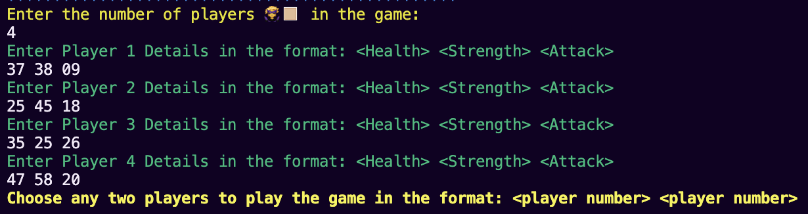
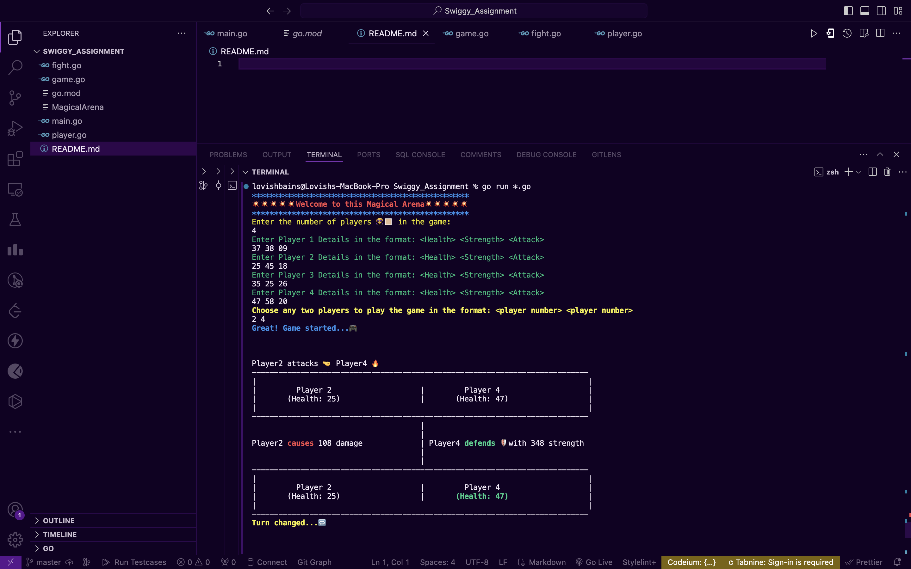

# The Magic Arena

Every Player in this game is defined by a “health” attribute, “strength” attribute and an “attack” attribute - all positive integers. The player dies if his health attribute touches 0. 
Any two player can fight a match in the arena. Players attack in turns. Attacking player rolls the attacking dice and the defending player rolls the defending dice. The “attack”  value multiplied by the outcome of the  attacking dice roll is the damage created by the attacker. The defender “strength” value, multiplied by the outcome of the defending dice is the damage defended by the defender. Whatever damage created by attacker which is in excess of the damage defended by the defender will reduce the “health” of the defender. Game ends when any players health reaches 0.
**Player with lower health attacks first at the start of a match.** 

**Example:**
Assume two players. Player A 50 health 5 strength 10 attack Player B 100 health 10 stregnth and 5 attack . Attacking die and Defending die are both 6 sided die with values ranging from 1- 6.

1. Player A attacks and rolls die. Die roll : 5 . Player B defends and rolls die. Die roll 2.
Attack damage is 5 * 10 = 50 ; Defending strength = 10 * 2 = 20 ; Player B health reduced by 30 to 70.

2. Player B attacks and rolls die. Die roll : 4. Player A defends and rolls die. Die Roll 3. Attack damage is 4 * 5 = 20 ; Defending strength = 5 * 3 = 15 ; Player A  health reduced by 5 to 45

3. And so on

This problem has been solved in Golang due to its efficiency and code simplicity. 


### Code Explanation
The file structure is as follows:
```
SWIGGY_ASSIGNMENT
  |
  |--main.go  //main file
  |
  |--player.go  //defines the player structure
  |
  |--game.go  //defines the game structure
  |
  |--fight.go  //defines the function for each turn of the player attack
```

The logic has been built such that the user can input multiple player details at the start of the game. The actual game will be played between any two of the choosen players from the list of player details. A slice has been used to store multiple objects of the Players.



Player structure defined is as follows:
```
type Player struct {
	 PlayerNumber int
	 Health int
	 Strength int
	 Attack int
}
```
Additional attribute, `PlayerNumber` has been added to keep a record of the player playing the game.

The minimum number of players required to start the game is `2`.

The player details are taken in the format:
```
<Health> <Strength> <Attack>
```

To choose any two players, the user needs to input the player numbers to start the match:
```
<player number 1> <player number 2>
```
Each player gets and alternative chance to roll the dice and attack.

The code structure adheres all the required criterias like scalability, readability, modelling, maintainability and testing.


### Installation and Compilation
Uncompress the file and then install go of the version mentioned in go.mod file. I've used go **version 1.21.3** here.

To install go of the version, run the following command:
```
go install <go version>
```
For more information, [refer to](https://go.dev/doc/manage-install).

To compile and run all the file together, run the following command:
```
go run main.go player.go fight.go game.go
```
 **Note: To manually change the version of go, modify the version in go.mod file.**


 ### Testing and Result
 
Checkout the following snippet of the terminal output:



Also checkout the attached screen recording to see complete code execution result.

 


 To perform unit testing, run the following command:
 ```
go test

 ```
 

 ### Future Scope
 
 1. The code structure is scalable in nature since it can deal with multiple users at a time.
 2. A front-end can be integrated which can enhance the presentation of the game.
 3. Certain more features and level challenges can be added to this code structure.
